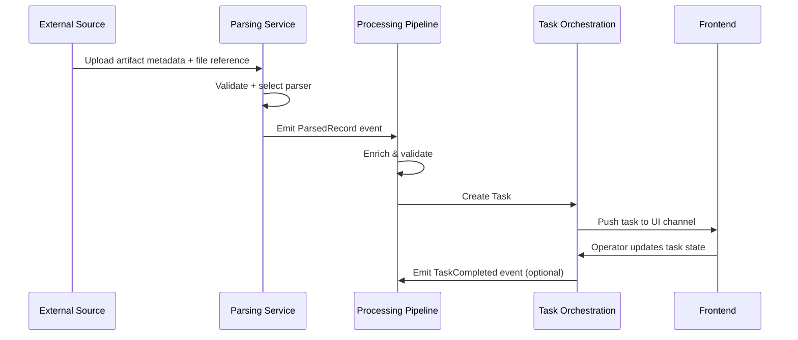
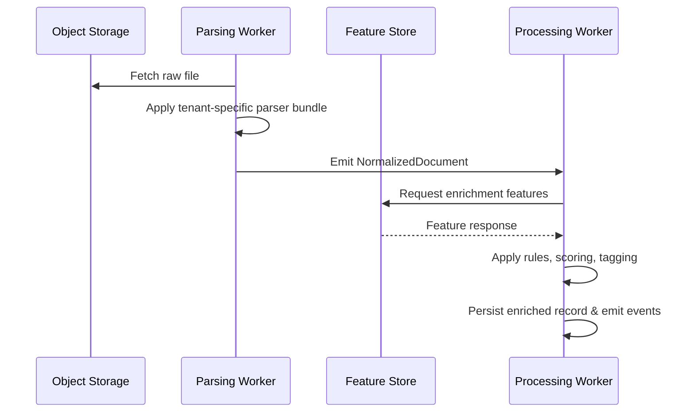
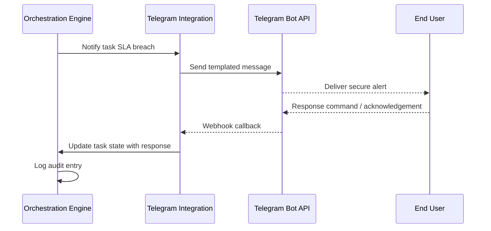
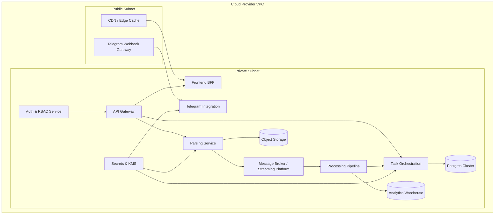

# Platform Architecture Blueprint

## Table of Contents
- [1. Executive Summary](#1-executive-summary)
- [2. Guiding Requirements](#2-guiding-requirements)
  - [2.1 Non-Functional Requirements](#21-non-functional-requirements)
  - [2.2 Domain Principles](#22-domain-principles)
- [3. Platform Modules](#3-platform-modules)
  - [3.1 Parsing Service](#31-parsing-service)
  - [3.2 Processing Pipeline](#32-processing-pipeline)
  - [3.3 Telegram Integration Service](#33-telegram-integration-service)
  - [3.4 Frontend Experience](#34-frontend-experience)
  - [3.5 Task Orchestration Engine](#35-task-orchestration-engine)
- [4. Service Boundaries & Contracts](#4-service-boundaries--contracts)
- [5. Data Flow Architecture](#5-data-flow-architecture)
- [6. Sequence Diagrams](#6-sequence-diagrams)
  - [6.1 Task Lifecycle](#61-task-lifecycle)
  - [6.2 Data Parsing & Enrichment](#62-data-parsing--enrichment)
  - [6.3 Telegram Alert Interaction](#63-telegram-alert-interaction)
- [7. Tenancy Isolation Strategy](#7-tenancy-isolation-strategy)
- [8. RBAC Model](#8-rbac-model)
- [9. External Integrations](#9-external-integrations)
- [10. Deployment Topology](#10-deployment-topology)
- [11. Observability & Operations](#11-observability--operations)
- [12. Phase Roadmap](#12-phase-roadmap)
- [13. Technology Rationale](#13-technology-rationale)

---

## 1. Executive Summary
The platform enables secure, multi-tenant processing of structured and semi-structured data with downstream task orchestration and human-in-the-loop collaboration via Telegram and web channels. The architecture is service-oriented, emphasizing isolation, auditable workflows, and extensibility. This blueprint documents module responsibilities, integration boundaries, data flows, operational guardrails, and deployment topology to guide implementation and growth.

## 2. Guiding Requirements
### 2.1 Non-Functional Requirements
- **Scalability:** Horizontally scale compute-intensive parsing and processing workloads via container orchestration and asynchronous job queues. Employ auto-scaling policies with workload-aware metrics.
- **Security:** Zero-trust posture inside the cluster; mutual TLS between services; encrypted data at rest (KMS-managed keys) and in transit; secrets managed via vault solution. Continuous vulnerability scanning and dependency management.
- **Anonymity & Privacy:** Pseudonymize tenant and end-user identifiers; segregate data per tenant in logical schemas; minimize PII exposure by default; ensure logs redact sensitive payloads.
- **Reliability:** Target 99.9% availability for core APIs; design idempotent task processing; use circuit breakers and retry policies to protect upstream systems.
- **Observability:** Centralized logging, metrics, and tracing with tenant-aware tagging; define SLOs dashboards; alert on error budget burn.
- **Compliance & Auditability:** Immutable audit log of task state changes; RBAC-enforced administrative actions; configurable retention policies per tenant.

### 2.2 Domain Principles
- **Modularity:** Clear service boundaries allow independent evolution of parsing, orchestration, and delivery channels.
- **Automation with Human Oversight:** Automated pipelines default to machine execution but surface exceptions for manual review via the frontend.
- **API-First:** Every capability exposed through versioned APIs supporting integration with partner systems.
- **Tenant Sovereignty:** Tenants control visibility and lifecycle of their data artifacts and automations.

## 3. Platform Modules

### 3.1 Parsing Service
- **Purpose:** Ingest raw documents (text, PDFs, structured feeds) and produce normalized, tenant-scoped datasets.
- **Responsibilities:**
  - Connector framework for file systems, S3-compatible storage, REST feeds.
  - Pluggable parsers using NLP/regex-based extractors; supports tenant-specific parser bundles.
  - Emits parsed records to the Processing Pipeline via message bus.
- **Interfaces:**
  - REST `POST /parse` and batch upload endpoints.
  - gRPC stream for high-throughput ingestion.
  - Consumes storage service APIs for artifact retrieval.
- **Storage:** Object storage (versioned) for raw files; Postgres schema or document DB for parsed fragments.
- **Scaling:** Stateless workers autoscaled by queue depth; CPU-intensive pods scheduled on dedicated node pool.

### 3.2 Processing Pipeline
- **Purpose:** Enrich, validate, and transform parsed data into actionable intelligence for downstream tasks.
- **Responsibilities:**
  - Validation rules engine supporting tenant-specific policies.
  - Enrichment via ML models and knowledge bases.
  - Event sourcing of state mutations in append-only store.
  - Outputs tasks to the Task Orchestration Engine.
- **Interfaces:**
  - Consumes messages from Parsing Service topic.
  - Exposes REST/gRPC endpoints for synchronous enrichment requests.
  - Publishes `TaskCreated`, `TaskUpdated`, `TaskError` events.
- **Storage:** Stream processor state in Kafka Streams / Redis Streams; canonical data in Postgres + columnar warehouse for analytics.

### 3.3 Telegram Integration Service
- **Purpose:** Enable secure, anonymous communication of alerts and task updates via Telegram bots.
- **Responsibilities:**
  - Manages tenant-scoped bot instances and webhook endpoints.
  - Performs message templating, localization, and rate limiting.
  - Validates user-device linkage using ephemeral tokens.
  - Captures inbound responses for round-trip processing.
- **Interfaces:**
  - Telegram Bot API webhooks.
  - Internal REST API to Task Orchestration for acknowledgement updates.
  - Outbound events to Notification service (if present) for multi-channel parity.
- **Security:** IP allowlisting, signature verification, optional Tor relay for anonymity-critical tenants.

### 3.4 Frontend Experience
- **Purpose:** Provide operations teams with dashboards, task management, audit trails, and administration controls.
- **Responsibilities:**
  - React/Next.js SPA served via CDN.
  - GraphQL gateway for aggregated reads; REST for mutations.
  - Offline-friendly task queue view and diff-based artifact viewer.
  - Integrates RBAC to restrict visibility.
- **Interfaces:**
  - GraphQL queries to API Gateway.
  - WebSockets for live task updates.
  - OAuth2/OIDC for authentication.

### 3.5 Task Orchestration Engine
- **Purpose:** Coordinate task lifecycles, SLA enforcement, and automation hooks.
- **Responsibilities:**
  - Workflow DSL (YAML/JSON) defining task states, transitions, and automation triggers.
  - Schedules asynchronous jobs on distributed queue (e.g., Temporal, Celery, or Argo Workflows).
  - Tracks SLAs, escalations, retries, and completion events.
  - Publishes state to notification channels (Telegram, email, webhooks).
- **Interfaces:**
  - REST/GraphQL API for task creation and state mutation.
  - Subscribes to Processing Pipeline events.
  - Emits audit logs to observability stack.

## 4. Service Boundaries & Contracts

| Service | Core Responsibilities | Exposed Contracts | Consumed Contracts | Persistence |
| --- | --- | --- | --- | --- |
| Parsing | Ingest & normalize raw data | REST `/parse`, gRPC stream, S3 upload callbacks | Object storage, Tenant config API | Object storage, Postgres (parsed) |
| Processing | Validate, enrich, generate tasks | REST `/enrich`, Event topics `Task*` | Parsing events, Feature store APIs | Kafka streams state, Postgres, Warehouse |
| Orchestration | Task lifecycle & workflow | REST `/tasks`, GraphQL, WebSockets | Processing events, RBAC service | Postgres (workflow), Redis (cache) |
| Telegram Integration | Messaging via Telegram | Telegram webhooks, REST `/notifications` | Orchestration events, Secrets service | Encrypted config store |
| Frontend | UX for operators | GraphQL `/api`, WebSockets | RBAC, Orchestration, Analytics APIs | CDN cache, Browser storage |

## 5. Data Flow Architecture

```mermaid
flowchart LR
    A[Data Sources\n(Files, APIs, Feeds)] -->|Upload| B[Object Storage]
    B --> C[Parsing Service]
    C -->|Normalized Events| D[Processing Pipeline]
    D -->|Valid Tasks| E[Task Orchestration]
    E -->|Updates| F[Telegram Integration]
    E -->|UI Feeds| G[Frontend]
    D -->|Analytics Stream| H[Data Warehouse]
    G -->|User Actions| E
    F -->|User Responses| E
```

## 6. Sequence Diagrams

### 6.1 Task Lifecycle


### 6.2 Data Parsing & Enrichment


### 6.3 Telegram Alert Interaction


## 7. Tenancy Isolation Strategy
- **Logical Isolation:** Dedicated schemas per tenant in Postgres and namespace per tenant in object storage. Processing topics prefixed with tenant IDs.
- **Runtime Isolation:** Kubernetes namespaces per tenant tier; resource quotas and network policies prevent lateral movement. Sensitive tenants can opt for dedicated node pools.
- **Configuration Isolation:** Tenant configuration stored in encrypted config service with per-tenant keys; service accounts scoped to tenant-specific resources.
- **Cross-Tenant Data Guarantees:** Validation gates ensure outbound notifications or analytics queries cannot join data across tenants without explicit cross-tenant contracts.
- **Anonymity Enhancements:** Use tokenized identifiers throughout pipelines; decrypt only at presentation layer when tenant security policy allows.

## 8. RBAC Model
| Role | Scope | Capabilities |
| --- | --- | --- |
| **Platform Super Admin** | Global | Manage tenants, view system health, rotate keys, configure global policies. Limited to trusted operators. |
| **Tenant Admin** | Tenant | Manage tenant members, assign roles, configure parsers, integration endpoints, SLA policies. |
| **Analyst/Operator** | Tenant | View tasks, approve/reject processing outcomes, trigger manual reprocessing, export reports (respecting audit trails). |
| **Automation Bot** | Tenant | Invoke APIs for automated actions (e.g., update task state) under scoped service tokens; cannot access UI-only endpoints. |
| **Read-Only Auditor** | Tenant/Regulator | Access immutable audit logs and metadata; no write permissions. |

- RBAC enforcement centralized via Authorization service, exposing PDP (policy decision) APIs; services integrate via sidecar or middleware.
- Policies expressed in OPA/Rego or Cedar; evaluated with tenant context and feature flags.

## 9. External Integrations
- **Telegram Bot API:** Primary outbound/inbound messaging channel; use dedicated bots per tenant when isolation required.
- **Object Storage (S3-compatible):** Intake channel for large artifacts; supports customer-managed buckets via signed URLs.
- **Feature Stores / ML Services:** Optional enrichment sources (e.g., Vertex AI, custom ML microservices).
- **Identity Provider (OIDC/SAML):** Integrates with customer IdPs for SSO; MFA enforced via IdP.
- **Analytics & BI:** Read replicas / warehouse exports to Snowflake/BigQuery for tenant dashboards, gated by data sharing agreements.

## 10. Deployment Topology



## 11. Observability & Operations
- **Monitoring Stack:** Prometheus/Grafana or Datadog with dashboards per tenant and subsystem.
- **Logging:** Centralized ELK/OpenSearch with ingestion filters for sensitive data; tenant ID mandatory in log schema.
- **Tracing:** OpenTelemetry instrumentation; traces sampled by tenant-criticality.
- **Alerting:** PagerDuty/On-call rotations; runbooks with SLAs defined per integration.
- **Resilience Testing:** Regular chaos drills on parsing and orchestration subsystems; synthetic transactions to verify Telegram delivery.

## 12. Phase Roadmap

### Phase 0 – Foundation
- Stand up core infrastructure (Kubernetes cluster, CI/CD, secrets management).
- Implement Parsing Service MVP with limited data formats and manual parser configuration.
- Deliver baseline Task Orchestration with manual state transitions.
- Provide basic frontend dashboards with authentication and RBAC enforcement.

### Phase 1 – Integrated Automation
- Introduce Processing Pipeline with validation and enrichment rules engine.
- Automate Telegram alerting with acknowledgement workflows.
- Add workflow DSL for dynamic task lifecycles and SLA monitoring.
- Establish tenant onboarding automation and config self-service.

### Phase 2 – Scalability & Intelligence
- Horizontal scaling policies for parsing/processing using autoscalers.
- Expand ML-driven enrichment and analytics warehouse exports.
- Enable cross-channel notifications (email/webhooks) with centralized template management.
- Implement advanced anonymity controls (differential privacy, secure enclaves for sensitive parsing).

## 13. Technology Rationale

| Concern | Preferred Technology | Rationale |
| --- | --- | --- |
| Container Orchestration | Kubernetes | Mature ecosystem, supports multi-tenancy via namespaces and network policies, integrates with service mesh. |
| Message Streaming | Apache Kafka / Redpanda | High-throughput pub/sub, replayable topics for auditing, supports partitioning by tenant. |
| Workflow Engine | Temporal / Cadence | Provides durable, fault-tolerant workflow state and rich SDKs for orchestration logic. |
| Data Storage | PostgreSQL (Citus/Crunchy) | Strong consistency, schema per tenant, extensions for JSONB and full-text search. |
| Object Storage | S3-compatible | Cost-effective, scalable storage with versioning support. |
| Secrets Management | HashiCorp Vault / AWS KMS | Centralized secret rotation, envelope encryption, hardware-backed keys. |
| Frontend Framework | Next.js (React) | Supports SSR/ISR for performance, rich ecosystem, easy integration with GraphQL. |
| API Gateway | Envoy / Kong | Handles auth, rate limiting, tenant routing, mutual TLS termination. |
| Observability | OpenTelemetry + Prometheus/Grafana | Vendor-agnostic instrumentation and actionable metrics. |
| Security Posture | OPA / Cedar policies | Fine-grained, auditable policy definitions enabling consistent RBAC and ABAC rules. |

---

**Status:** Draft blueprint ready for review. Update iteratively as detailed designs mature and implementation feedback is collected.
